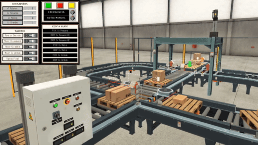

<!-- PROJECT LOGO -->
 

  <h3 align="center">Autonomous Warehouse </h3>

  

    Box size classifier using ladder programming and Factory.io for simulation
     
    <a href="https://github.com/Fabioo29/factoryio-ladder"><strong>Explore the docs »</strong></a>
  

<!-- TABLE OF CONTENTS -->

  
<h2 style="display: inline-block">Table of Contents</h2>

  <ol>
    <li><a href="#about">About</a></li>
    <li><a href="#license">License</a></li>
    <li><a href="#contact">Contact</a></li>
  </ol>

<!-- ABOUT THE PROJECT -->
## About

  

The purpose of this project is to implement a system that can classify the type of each box based on its height and redirect it with the pallet to a final point. As a final step of the process the system is able to reallocate up to four boxes into one pallet with a help of 3-Axis gripper arm. ([video](https://youtu.be/RGSv4VqE4cI))
All the project simulation was tested on FactoryIO (software for warehouse simulation)(simulation.factoryio) but all the instructions for it were projected in ladder programming using Cx-Programmer(ladder_main). The communication between Cx-programmer and FactoryIO is possible due to a Communication Bridge algorithm(commun_bridge) made in Visual Studio (C#). The  simulation also has a GUI (user interface) built in Cx-Designer(user_interface) for the user to control all the simulation process.
  

***Tested with*** Super slowmo speed due to communication issues from the bridge

***Built With*** 
[FactoryIO](https://factoryio.com/?gclid=Cj0KCQjw3duCBhCAARIsAJeFyPUnjkQ9GKmFmG1FWS_c1rO8Tpdz17S8eYPNDtwqx3tNrffUa4dTddMaAgdFEALw_wcB),
[Cx-One](https://industrial.omron.pt/pt/products/cx-one) (Cx-programmer, Cx-designer, Cx-server) and
[Visual studio](https://visualstudio.microsoft.com/) (or any other C# comatible IDE)

<!-- LICENSE -->
## License

Distributed under the MIT License. See `LICENSE` for more information.

<!-- CONTACT -->
## Contact

Fábio Oliveira - [LinkedIn](https://www.linkedin.com/in/fabioo29/) - fabiodiogo29@gmail.com

Project Link: [https://github.com/Fabio29/factoryio-ladder](https://github.com/Fabioo29/factoryio-ladder)  
Project built as a ECE student at Instituto Politécnico do Cavado e do Ave.

[pic-1]: resources/image1.png
[gif]: resources/gif.gif
